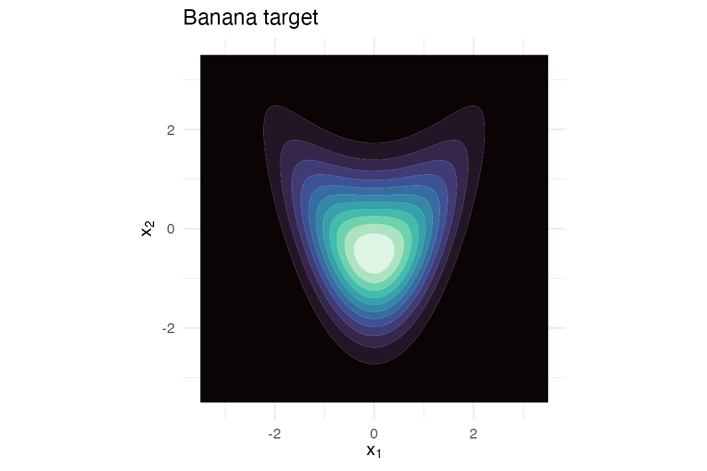

# KLD-EM on three density shapes

``` r

library(proxymix)
```

This vignette demonstrates regime (iii) across target shapes. The KLD-EM
regime fits a Gaussian-mixture proxy to a target whose density we can
*evaluate* but cannot easily *sample from*. Existing CRAN packages for
Gaussian mixtures – `mclust`, `mixtools`, `flexmix` – all assume i.i.d.
samples are available.

We exercise three quite different non-Gaussian target shapes:

- the **banana** – a Rosenbrock-style 2-D bent ridge;
- the **donut** – a rotationally symmetric annulus;
- the **three-mixture** – well-separated 2-D Gaussian components.

For each, we

1.  plot the target;
2.  fit by `fit_proxymix(regime = "kld")` with a `df = 5` multivariate-t
    proposal;
3.  report the importance-sample effective size, the final IS-estimated
    KLD, and a Monte-Carlo Hellinger sanity check;
4.  overlay the proxy on the target.

## Banana

``` r

banana <- banana_target()

grid_x <- seq(-3.5, 3.5, length.out = 120)
G_b <- expand.grid(x1 = grid_x, x2 = grid_x)
G_b$f <- exp(banana@log_density(as.matrix(G_b)))

if (requireNamespace("ggplot2", quietly = TRUE)) {
  library(ggplot2)
  ggplot(G_b, aes(x1, x2, z = f)) +
    geom_contour_filled(bins = 12L) +
    scale_fill_viridis_d(option = "mako", guide = "none") +
    coord_equal() +
    labs(title = "Banana target",
         x = expression(x[1]), y = expression(x[2])) +
    theme_minimal(base_size = 11)
}
```



Banana target.

``` r

fit_b <- fit_proxymix(banana, N = 4L, regime = "kld",
                      proposal = is_mvt(n_dim = 2L,
                                        sigma = 4 * diag(2),
                                        df = 5),
                      is_size = 3000L,
                      max_iter = 50L,
                      seed = 1L)
fit_b
#> <gmm_fit>: regime = "kld", K = 4, p = 2
#>   target     : banana
#>   iterations : 46
#>   converged  : TRUE
#>   [1] w = 0.4330, |mu| = 0.1166, tr(Sigma) = 1.2545
#>   [2] w = 0.2123, |mu| = 0.9733, tr(Sigma) = 0.9433
#>   [3] w = 0.1929, |mu| = 1.1925, tr(Sigma) = 2.8870
#>   [4] w = 0.1618, |mu| = 1.2661, tr(Sigma) = 2.5167
```

``` r

G_b$g <- exp(dgmm(as.matrix(G_b[, c("x1", "x2")]), fit_b, log = TRUE))
if (requireNamespace("ggplot2", quietly = TRUE)) {
  ggplot(G_b, aes(x1, x2)) +
    geom_contour_filled(aes(z = f), bins = 10L, alpha = 0.85) +
    geom_contour(aes(z = g), colour = "white", linetype = "dashed",
                 linewidth = 0.4, bins = 8L) +
    scale_fill_viridis_d(option = "mako", guide = "none") +
    coord_equal() +
    labs(title = "Banana with proxy",
         x = expression(x[1]), y = expression(x[2])) +
    theme_minimal(base_size = 11)
}
```


Banana target (filled) with 4-component proxy (dashed).

## Donut

``` r

donut <- donut_target()

grid_x <- seq(-4, 4, length.out = 120)
G_d <- expand.grid(x1 = grid_x, x2 = grid_x)
G_d$f <- exp(donut@log_density(as.matrix(G_d)))

if (requireNamespace("ggplot2", quietly = TRUE)) {
  ggplot(G_d, aes(x1, x2, z = f)) +
    geom_contour_filled(bins = 12L) +
    scale_fill_viridis_d(option = "mako", guide = "none") +
    coord_equal() +
    labs(title = "Donut target",
         x = expression(x[1]), y = expression(x[2])) +
    theme_minimal(base_size = 11)
}
```


Donut target (rotationally symmetric annulus).

A donut is genuinely hard for a Gaussian mixture – the modes are
*infinitely many* (along the ring). With `N = 6` components, KLD-EM
finds a balanced ring-approximation:

``` r

fit_d <- fit_proxymix(donut, N = 6L, regime = "kld",
                      proposal = is_mvt(n_dim = 2L,
                                        sigma = 9 * diag(2),
                                        df = 5),
                      is_size = 3500L,
                      max_iter = 60L,
                      seed = 1L)
fit_d
#> <gmm_fit>: regime = "kld", K = 6, p = 2
#>   target     : donut
#>   iterations : 38
#>   converged  : TRUE
#>   [1] w = 0.1857, |mu| = 2.4064, tr(Sigma) = 1.2368
#>   [2] w = 0.1843, |mu| = 2.4028, tr(Sigma) = 1.1954
#>   [3] w = 0.1704, |mu| = 2.3580, tr(Sigma) = 1.1155
#>   [4] w = 0.1619, |mu| = 2.4566, tr(Sigma) = 0.9912
#>   [5] w = 0.1575, |mu| = 2.4804, tr(Sigma) = 1.0185
#>   ... 1 more components
```

``` r

G_d$g <- exp(dgmm(as.matrix(G_d[, c("x1", "x2")]), fit_d, log = TRUE))
if (requireNamespace("ggplot2", quietly = TRUE)) {
  ggplot(G_d, aes(x1, x2)) +
    geom_contour_filled(aes(z = f), bins = 10L, alpha = 0.85) +
    geom_contour(aes(z = g), colour = "white", linetype = "dashed",
                 linewidth = 0.4, bins = 8L) +
    scale_fill_viridis_d(option = "mako", guide = "none") +
    coord_equal() +
    labs(title = "Donut with proxy",
         x = expression(x[1]), y = expression(x[2])) +
    theme_minimal(base_size = 11)
}
```


Donut target (filled) with 6-component proxy (dashed).

## Three-mixture

``` r

mt <- mixture_target()

grid_x <- seq(-4.5, 4.5, length.out = 120)
G_m <- expand.grid(x1 = grid_x, x2 = grid_x)
G_m$f <- exp(mt@log_density(as.matrix(G_m)))

if (requireNamespace("ggplot2", quietly = TRUE)) {
  ggplot(G_m, aes(x1, x2, z = f)) +
    geom_contour_filled(bins = 12L) +
    scale_fill_viridis_d(option = "mako", guide = "none") +
    coord_equal() +
    labs(title = "Three-mixture target",
         x = expression(x[1]), y = expression(x[2])) +
    theme_minimal(base_size = 11)
}
```


Three-component mixture target.

``` r

fit_m <- fit_proxymix(mt, N = 3L, regime = "kld",
                      proposal = is_mvt(n_dim = 2L,
                                        sigma = 6 * diag(2),
                                        df = 5),
                      is_size = 3000L,
                      max_iter = 50L,
                      seed = 1L)
fit_m
#> <gmm_fit>: regime = "kld", K = 3, p = 2
#>   target     : three_mixture
#>   iterations : 10
#>   converged  : TRUE
#>   [1] w = 0.4164, |mu| = 0.0300, tr(Sigma) = 0.8377
#>   [2] w = 0.3069, |mu| = 2.7545, tr(Sigma) = 1.2249
#>   [3] w = 0.2767, |mu| = 2.7562, tr(Sigma) = 0.8740
```

``` r

G_m$g <- exp(dgmm(as.matrix(G_m[, c("x1", "x2")]), fit_m, log = TRUE))
if (requireNamespace("ggplot2", quietly = TRUE)) {
  ggplot(G_m, aes(x1, x2)) +
    geom_contour_filled(aes(z = f), bins = 10L, alpha = 0.85) +
    geom_contour(aes(z = g), colour = "white", linetype = "dashed",
                 linewidth = 0.4, bins = 8L) +
    scale_fill_viridis_d(option = "mako", guide = "none") +
    coord_equal() +
    labs(title = "Three-mixture with proxy",
         x = expression(x[1]), y = expression(x[2])) +
    theme_minimal(base_size = 11)
}
```


Three-mixture target (filled) with 3-component proxy (dashed).

## Bounded support

The three targets above all live on the whole plane. Some targets are
instead **compactly supported** – exactly zero outside a bounded region.
The textbook example is the Epanechnikov density
$`K(u) = \tfrac{3}{4}(1 - u^2)`$ on $`[-1, 1]`$. No mixture of
full-support Gaussians can be exactly zero on an interval, so regime
(iii) is the only viable route – and the default $`t`$-proposal is
actively unsafe here, since it places importance draws where the target
log-density is $`-\infty`$, producing non-finite weights.

`proxymix` handles this safely. A target can declare its `support`, and
[`fit_kld_em()`](https://max578.github.io/proxymix/reference/fit_kld_em.md)
then selects a *support-matched*
[`is_uniform()`](https://max578.github.io/proxymix/reference/is_uniform.md)
proposal automatically instead of the crashing default.
[`epanechnikov_target()`](https://max578.github.io/proxymix/reference/epanechnikov_target.md)
is a built-in compact-support fixture that declares its support:

``` r

epan <- epanechnikov_target(n_dim = 1L)
epan
#> <gmm_target>: "epanechnikov" in p = 1 dimensions
#>   log_density : supplied
#>   samples     : <absent>
#>   normalised  : TRUE
#>   log Z(f)    : 0
#>   support     : [-1, 1]
```

Fitting needs no hand-chosen proposal – the declared support drives the
choice, announced in a one-line message:

``` r

fit_e <- fit_proxymix(epan, N = 3L, regime = "kld",
                      is_size = 4000L, max_iter = 60L, seed = 1L)
#> Auto-selected a support-matched proposal ("is_uniform[support-matched]") for
#> the declared target support.
#> ℹ Pass an explicit `proposal` to override.
fit_e@diagnostics$proposal_name
#> [1] "is_uniform[support-matched]"
c(ess = round(fit_e@diagnostics$ess, 1L),
  support_fraction = fit_e@diagnostics$support_fraction,
  kld_final = round(fit_e@diagnostics$kld_final, 4L))
#>              ess support_fraction        kld_final 
#>        3298.5000           1.0000           0.0092
```

Every importance draw receives a finite weight (the support fraction is
1), and the three-component proxy tracks the inverted-parabola shape
closely:

``` r

xs <- seq(-1.4, 1.4, length.out = 400L)
df_e <- data.frame(
  x = xs,
  f = exp(epan@log_density(matrix(xs, ncol = 1L))),
  g = exp(dgmm(matrix(xs, ncol = 1L), fit_e, log = TRUE))
)
if (requireNamespace("ggplot2", quietly = TRUE)) {
  ggplot(df_e, aes(x)) +
    geom_line(aes(y = f), linewidth = 0.8) +
    geom_line(aes(y = g), linetype = "dashed", linewidth = 0.6,
              colour = "#2c7fb8") +
    labs(title = "Epanechnikov with proxy", y = "density") +
    theme_minimal(base_size = 11)
}
```


Epanechnikov target (solid) with 3-component proxy (dashed).

## Summary

``` r

summary_tbl <- data.frame(
  target      = c("banana", "donut", "three-mixture"),
  N           = c(gmm_n_components(fit_b),
                  gmm_n_components(fit_d),
                  gmm_n_components(fit_m)),
  is_size     = c(fit_b@diagnostics$is_size,
                  fit_d@diagnostics$is_size,
                  fit_m@diagnostics$is_size),
  ESS         = round(c(fit_b@diagnostics$ess,
                        fit_d@diagnostics$ess,
                        fit_m@diagnostics$ess), 1L),
  kld_final   = round(c(fit_b@diagnostics$kld_final,
                        fit_d@diagnostics$kld_final,
                        fit_m@diagnostics$kld_final), 4L),
  hellinger2  = round(c(
    hellinger_mc(fit_b, n_mc = 2000L, seed = 1L)$h2,
    hellinger_mc(fit_d, n_mc = 2000L, seed = 1L)$h2,
    hellinger_mc(fit_m, n_mc = 2000L, seed = 1L)$h2
  ), 4L)
)
summary_tbl
#>          target N is_size    ESS kld_final hellinger2
#> 1        banana 4    3000 1234.4    0.0060     0.0008
#> 2         donut 6    3500 1034.7   -0.0044    -0.0067
#> 3 three-mixture 3    3000  757.7   -0.0082    -0.0064
```

Interpretation:

- **`ESS`** – the effective sample size of the importance-sampling
  weights, out of `is_size`. ESS well below `is_size` means the proposal
  is wasteful (heavy weight on few draws); ESS near `is_size` means the
  proposal is close to the target.
- **`kld_final`** – the importance-sampled estimate of
  $`\mathrm{KL}(f \Vert g_\theta)`$ at the final parameters. *Small is
  good.*
- **`hellinger2`** – a Monte-Carlo estimate of the squared Hellinger
  distance $`H^2(f, g)`$. Bounded in $`[0, 1]`$ when both densities are
  normalised; a small value confirms the proxy reproduces the target’s
  mass *and* shape.

The three-mixture is fit nearly exactly (the proxy lives in the same
parametric family as the target). The banana is well-approximated by
four Gaussians along the ridge. The donut – a topology a Gaussian
mixture cannot reproduce exactly – is approximated by a ring of 6
components, with a non-trivial residual KLD reflecting the structural
mismatch.

## Reference

Hoek, J. van der and Elliott, R. J. (2024). *Mixtures of multivariate
Gaussians.* Stochastic Analysis and Applications.
<https://doi.org/10.1080/07362994.2024.2372605>.
