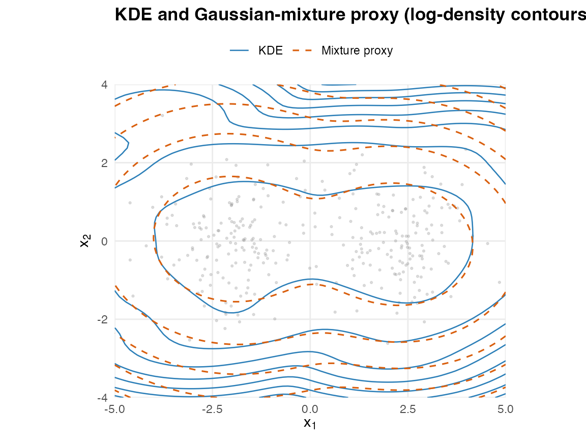

# From KDE: compressing a kernel density estimate into a Gaussian-mixture proxy

``` r

library(proxymix)
library(ggplot2)
```

## Why a `from_kde()` constructor

A kernel density estimate (KDE) gives a smooth, non-parametric density
from a sample of `n` points, but with three operational costs:

- **No closed-form marginals.** Integrating out a coordinate of a KDE
  requires a numerical sweep over the kernel mixture.
- **No closed-form conditioning.** There is no analogue of the Schur
  complement; one has to resample or build a conditional KDE per query.
- **No native aggregation algebra.** Pushforwards through linear
  operators, observation-channel updates, or block-sums all collapse to
  Monte Carlo.

[`proxymix::from_kde()`](https://max578.github.io/proxymix/reference/from_kde.md)
*compresses* the KDE into an `N`-component Gaussian mixture proxy (with
`N` typically much smaller than `n`) by treating the KDE as a
normalised, evaluable target and running regime (iii) KLD-EM against it.
The proxy then supports the full closed-form operator set exposed by the
rest of the package –
[`dgmm()`](https://max578.github.io/proxymix/reference/dgmm.md),
[`rgmm()`](https://max578.github.io/proxymix/reference/rgmm.md),
[`gmm_marginalise()`](https://max578.github.io/proxymix/reference/gmm_marginalise.md),
[`gmm_conditionalise()`](https://max578.github.io/proxymix/reference/gmm_conditionalise.md),
plus the v0.3 affine-Gaussian calculus
([`gmm_affine()`](https://max578.github.io/proxymix/reference/gmm_affine.md),
[`gmm_observe()`](https://max578.github.io/proxymix/reference/gmm_observe.md)).

This is **not new science**. It is a practical bridge between a
non-parametric density estimate and a parametric closed-form mixture
representation. The bias inherited from the KDE is reproduced in the
proxy; the bandwidth controls the bias-variance trade-off.

## Recovering a known mixture

Sample from a known bimodal mixture and ask
[`from_kde()`](https://max578.github.io/proxymix/reference/from_kde.md)
to recover it.

``` r

set.seed(1L)
true_means <- list(c(-2, 0), c(2, 0))
true_cov   <- diag(2)
x <- rbind(
  mvnfast::rmvn(150L, mu = true_means[[1L]], sigma = true_cov),
  mvnfast::rmvn(150L, mu = true_means[[2L]], sigma = true_cov)
)

fit <- from_kde(
  x, N = 2L,
  bandwidth = "silverman",
  is_size = 2000L, max_iter = 60L, seed = 1L,
  validation_size = 2000L
)
fit
#> <gmm_fit>: regime = "kld", K = 2, p = 2
#>   target     : from_kde
#>   iterations : 15
#>   converged  : TRUE
#>   [1] w = 0.5083, |mu| = 1.9840, tr(Sigma) = 3.0490
#>   [2] w = 0.4917, |mu| = 2.2039, tr(Sigma) = 2.4588
```

The proxy components sit near the true means.

``` r

vapply(fit@means, function(mu) round(mu, 2L), numeric(2L))
#>       [,1]  [,2]
#> [1,] -1.98  2.20
#> [2,]  0.05 -0.08
```

## Quality of the importance-sampled fit

Inspect ESS and the largest self-normalised weight: a healthy
regime-(iii) fit has ESS close to `is_size` and a max-weight share of a
few percent.

``` r

ess_summary(fit)
#> $is_size
#> [1] 2000
#> 
#> $ess
#> [1] 1532.381
#> 
#> $ess_relative
#> [1] 0.7661903
#> 
#> $max_weight
#> [1] 0.001171959
#> 
#> $support_fraction
#> [1] 1
#> 
#> $mc_se_kld
#> [1] 0.005589403
#> 
#> $validation_size
#> [1] 2000
#> 
#> $validation_ess
#> [1] 1530.978
#> 
#> $validation_ess_relative
#> [1] 0.7654892
#> 
#> $validation_max_weight
#> [1] 0.00116206
#> 
#> $validation_support_fraction
#> [1] 1
#> 
#> $validation_kld
#> [1] 0.02483515
```

The validation block reports a held-out KLD on an independent IS draw –
a safeguard against in-sample overfitting to one particular IS
realisation.

## Bandwidth sensitivity

Smaller bandwidths track the data more tightly (lower bias, higher
variance); larger bandwidths smooth the proxy. The proxy inherits this
trade-off.

``` r

bandwidth_grid <- c(0.2, 0.5, 1.0)
fits <- lapply(bandwidth_grid, function(h) {
  from_kde(x, N = 2L, bandwidth = h,
           is_size = 1500L, max_iter = 40L, seed = 1L)
})

data.frame(
  bandwidth      = bandwidth_grid,
  ess            = vapply(fits, function(f) f@diagnostics$ess, numeric(1L)),
  max_weight     = vapply(fits, function(f) f@diagnostics$max_weight, numeric(1L)),
  trace_Sigma_k1 = vapply(fits, function(f) sum(diag(f@covariances[[1L]])), numeric(1L))
)
#>   bandwidth       ess  max_weight trace_Sigma_k1
#> 1       0.2  768.4537 0.007158846       2.165142
#> 2       0.5  997.8578 0.001887074       2.463437
#> 3       1.0 1189.3327 0.001287610       3.816308
```

## Visualising the compression

Compare the KDE log-density and the proxy log-density on a planar grid.

``` r

grid <- expand.grid(
  x = seq(-5, 5, length.out = 80L),
  y = seq(-4, 4, length.out = 60L)
)
gm <- as.matrix(grid)
kde_log_density <- fit@target@log_density
grid$kde   <- kde_log_density(gm)
grid$proxy <- log(dgmm(gm, fit))

## Shared contour levels so the two log-densities are directly comparable.
brks <- pretty(range(c(grid$kde, grid$proxy), finite = TRUE), 9L)
ggplot() +
  geom_point(data = as.data.frame(x), aes(V1, V2),
             colour = "grey55", alpha = 0.25, size = 0.5) +
  geom_contour(data = grid,
               aes(x, y, z = kde, colour = "KDE", linetype = "KDE"),
               breaks = brks, linewidth = 0.45) +
  geom_contour(data = grid,
               aes(x, y, z = proxy,
                   colour = "Mixture proxy", linetype = "Mixture proxy"),
               breaks = brks, linewidth = 0.55) +
  scale_colour_manual(name = NULL,
                      values = c("KDE" = "#2C7FB8",
                                 "Mixture proxy" = "#D95F0E")) +
  scale_linetype_manual(name = NULL,
                        values = c("KDE" = "solid",
                                   "Mixture proxy" = "dashed")) +
  coord_equal(expand = FALSE) +
  labs(title = "KDE and Gaussian-mixture proxy (log-density contours)",
       x = expression(x[1]), y = expression(x[2])) +
  theme_minimal(base_size = 11) +
  theme(plot.title = element_text(face = "bold"),
        legend.position = "top",
        panel.grid.minor = element_blank())
```



## Scope and limits (v0.2)

- **Dimensional cap.**
  [`from_kde()`](https://max578.github.io/proxymix/reference/from_kde.md)
  is well-tested for `p <= 5`; it warns between `p = 6` and `p = 10`,
  and refuses `p > 10`. Regime (iii) is driven by importance sampling,
  whose effective sample size falls sharply in high dimensions. For
  richer ambient spaces, compose a low-`p` proxy with the
  affine-Gaussian operator calculus rather than fitting in the ambient
  space.
- **Bandwidth shapes.** Only scalar and diagonal bandwidths are
  supported. A full-matrix bandwidth effectively encodes a covariance
  estimate and blurs the KDE-vs-mixture distinction; if that is what you
  want, fit the mixture directly with `fit_proxymix(regime = "sample")`.
- **Normalisation.** A KDE is normalised by construction, so the
  returned `gmm_target` declares `normalised = TRUE` and
  `log_normalizer = 0`. This makes
  [`hellinger_mc()`](https://max578.github.io/proxymix/reference/hellinger_mc.md)
  meaningful and lets the KLD diagnostics report absolute values, not
  shifted ones.
- **What this is not.** It is not a method for *picking* the KDE
  bandwidth. Use the conventional rules of thumb (`"silverman"`,
  `"scott"`) or a cross-validation procedure outside the package, then
  pass the chosen bandwidth in.

## When to prefer `fit_proxymix(regime = "sample")` instead

If your goal is “find a Gaussian-mixture density given samples”, the
classical EM regime is more direct, fits in linear time, and does not
incur the regime-(iii) importance-sampling tax.
[`from_kde()`](https://max578.github.io/proxymix/reference/from_kde.md)
only earns its place when you specifically want the KDE’s smoothing as a
step in your pipeline – e.g. as part of a sequence such as

    samples |> from_kde() |> gmm_conditionalise() |> rgmm()

– or when the KDE’s bias-variance trade-off is part of what you are
trying to validate downstream.

## References

- Hoek, J. van der and Elliott, R. J. (2024). *Mixtures of multivariate
  Gaussians.* Stochastic Analysis and Applications.
  <doi:10.1080/07362994.2024.2372605>.
- Silverman, B. W. (1986). *Density Estimation for Statistics and Data
  Analysis.* CRC Press.
- Scott, D. W. (1992). *Multivariate Density Estimation: Theory,
  Practice, and Visualization.* Wiley.
